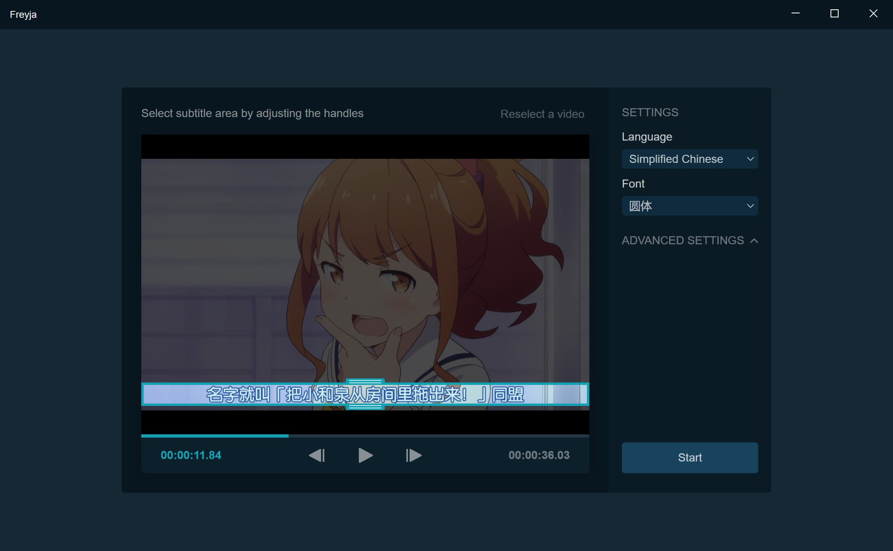
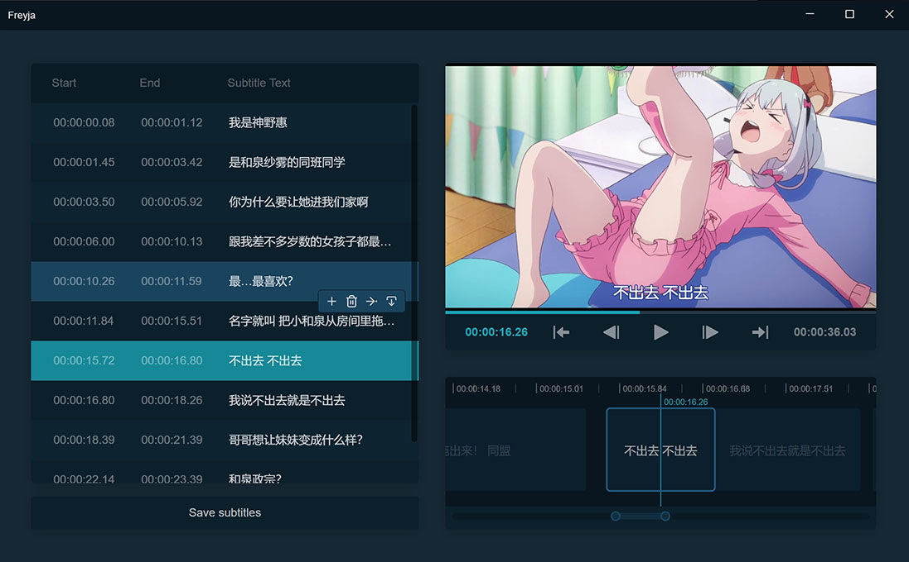

# freyja

Nodejs + electron user interface for freyja subtitle OCR extractor.

Still in beta. All functionality are useable, but you may meet bug / crash when using the app. Please report any bugs
you meet with your ```log.log``` file on github issues.





## System requirements

16GB of RAM required. Having a Nvidia GPU is strongly recommended or the process will be extremely slow.

## Usage

1. If you are using MacOS or Linux, make sure you have ```ffmpeg``` installed.

2. Download latest version of freyja from [Releases](https://github.com/freyjaSubOCR/freyja-sub-ocr-electron/releases) page and extract it.

3. Download models from <https://github.com/freyjaSubOCR/freyja-sub-ocr-model-zoo/releases> (all txt and torchscript files are needed), and place all files into ```<app_path>/models/``` folder.

4. Run ```freyja.exe```.

## Known issues

- Video player is laggy.

  Current video player implementation does not work well on real time video playback, a new implementation will be
  available when the app is out of beta.

## FAQ

- Q: Cannot play the video.

  A: Your video is an vfr (variable frame rate) video, which is not supported on current video player implementation.
  You can do a fast transcoding using ffmpeg: ```ffmpeg -i video.mkv video_transcoded.mkv```. Note: remux won't work.

- Q: Cannot use CUDA version.

  A: Make sure you have a recent Nvidia GPU. If you do not have a Nvidia GPU, you can use the CPU version. If you do
  have a Nvidia GPU, please try to update the driver.
  