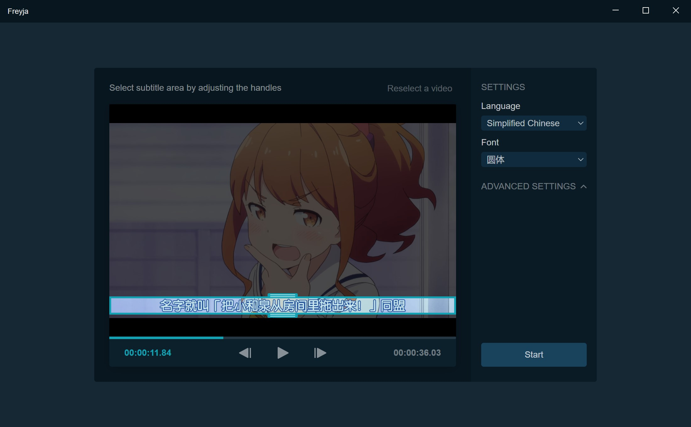
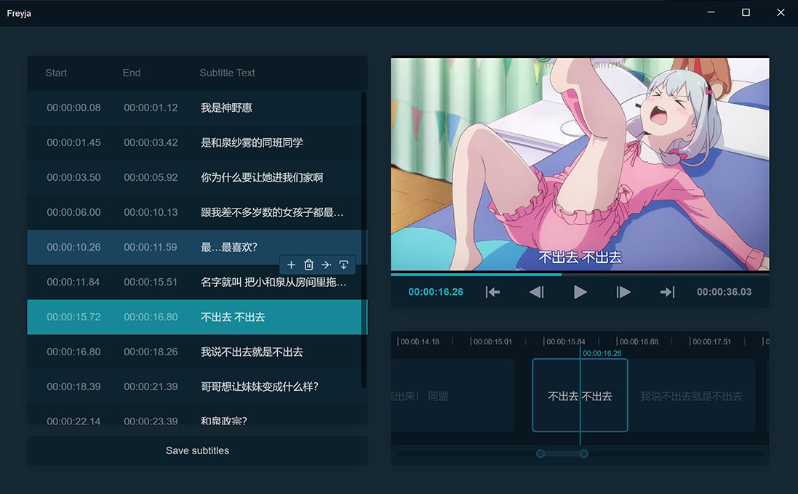

# Freyja

使用 Nodejs 和 Electron 编写的 Freyja 视频硬字幕提取 App 的用户界面。

目前仍然在 beta 测试中。基本功能都是可用的，但是可能会遇到 bug 或者随机崩溃等问题。如果你碰到了问题，请带上```log.log```
文件，然后在 Github issues 中报告。





## 系统要求

Freyja 需要 8GB 的内存。强烈推荐使用带 Nvidia 显卡的电脑，否则过程会非常缓慢。

## 使用

1. 如果你使用的是 Windows，安装[Visual C++ Redist 2019](https://aka.ms/vs/16/release/vc_redist.x64.exe)。如果你使用的是
   MacOS 或 Linux ，确保已安装```ffmpeg```。

2. 从[Release页](https://github.com/freyjaSubOCR/freyja-sub-ocr-electron/releases)下载最新版本的Freyja并将其解压缩。

3. 从<https://github.com/freyjaSubOCR/freyja-sub-ocr-model-zoo/releases>中下载模型。下载对应模型的所有txt和torchscript文
   件，并将这些文件放入```<app_path>/models/```文件夹。

4. 运行```freyja.exe```。如果有 Nvidia 显卡，请启用```Enable CUDA```选项，否则禁用该选项。

## 已知的问题

- 视频播放很慢

  目前的视频播放实现不是很可靠，会占用比较多的内存并且会有播放卡顿。在正式版推出之前会有新的视频播放实现。

- 无法使用 MacOS 和 Linux 版本

  当前，底层的```torch-js```包存在一些问题。下一个测试版本预计会修复这个问题。

## 常见问题

- 视频播放没有声音。

  目前视频播放器没有播放声音功能。

- 无法播放视频。

  这个视频可能是vfr（可变帧率）视频，当前视频播放器不支持播放这类视频。一个比较简单的解决方法是使用ffmpeg进行转码，来把视频转换为恒定帧率视频：```ffmpeg -i video.mkv video_transcoded.mkv```。

- 无法使用GPU模型。

  确认你有 Nvidia 的显卡。如果确实有 Nvidia 的显卡，请尝试更新驱动程序。

- 程序提示 "pyTorch backend crashed"。

  检查一下 ```log.log``` 中的最后一条错误信息。
  
  如果log中有 ```CUDA out of memory``` 的提示，说明显存不足。可以通过降低 ```batch size``` 来减少显存使用。如果降低
  ```batch size``` 不起作用，说明你的显存太小，请换用CPU模型。

  如果log显示其他错误，请尝试改变视频裁剪的大小然后重试。
